# DESPLIEGUE — Evidencias y respuestas

Este documento recopila todas las evidencias y respuestas de la practica.

---

## Parte 1 — Evidencias minimas

### Fase 1: Instalacion y configuracion

1) Servicio Nginx activo

He levantado el contenedor de Nginx con docker compose y he verificado que está corriendo correctamente.

- Que demuestra: El contenedor de Nginx está corriendo y activo
- Comando: `docker compose ps` o `docker ps`
- Evidencia:
  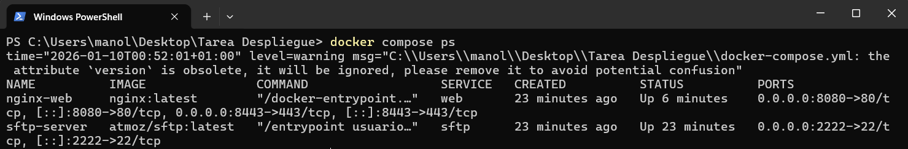

2) Configuracion cargada

He ejecutado el test de configuración de Nginx para comprobar que no hay errores de sintaxis en el archivo default.conf.

- Que demuestra: La configuración de Nginx se ha cargado correctamente sin errores de sintaxis
- Comando: `docker compose exec web nginx -t`
- Evidencia:
  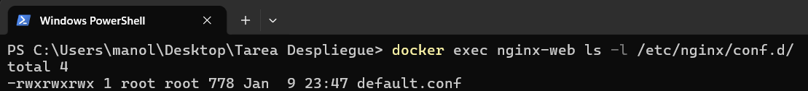

3) Resolucion de nombres

He accedido desde el navegador usando localhost y también verificando que se resuelve el nombre configurado (paginaDeNolo) y el puerto configurado para verificar que el servidor responde.

- Que demuestra: El navegador resuelve correctamente el nombre de dominio configurado (paginaDeNolo)
- Evidencia:
  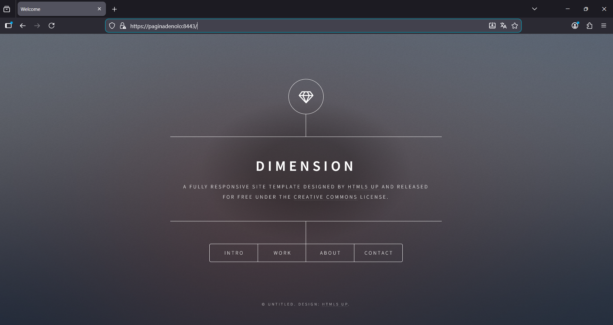

4) Contenido Web

He subido el contenido web mediante SFTP y he verificado que se muestra correctamente en el navegador.

- Que demuestra: El sitio web se visualiza correctamente en el navegador
- Evidencia:
  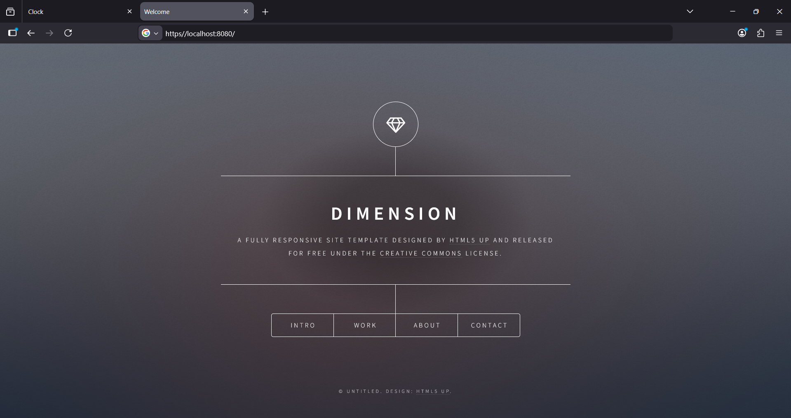

### Fase 2: Transferencia SFTP (Filezilla)

5) Conexion SFTP exitosa

He configurado FileZilla con los datos de conexión (localhost, puerto 2222, usuario y contraseña) y me he conectado al servidor SFTP.

- Que demuestra: Conexión exitosa al servidor SFTP mediante Filezilla
- Evidencia:
  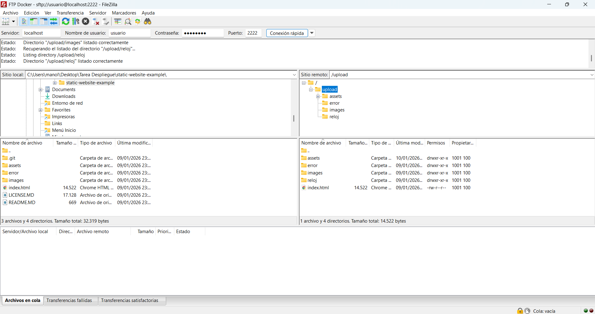

6) Permisos de escritura

He subido archivos desde FileZilla al servidor SFTP y he comprobado que se guardan correctamente en el volumen compartido.

- Que demuestra: Se pueden subir archivos al servidor SFTP y se reflejan en el volumen compartido
- Evidencia:
  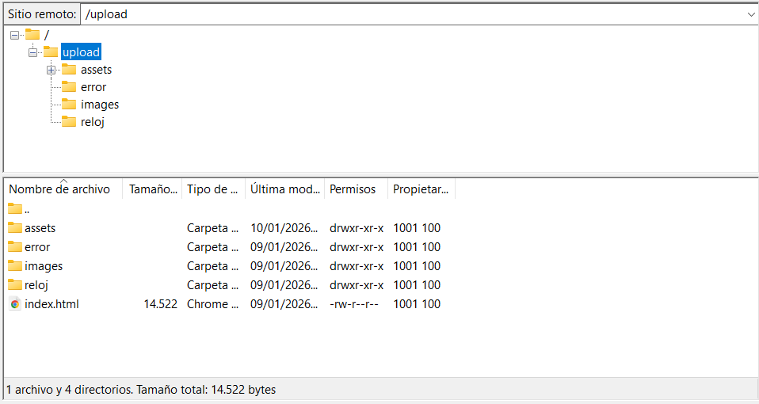

### Fase 3: Infraestructura Docker

7) Contenedores activos

He verificado que los dos contenedores del docker-compose (web y sftp) están corriendo sin problemas.

- Que demuestra: Los dos contenedores (Nginx y SFTP) están ejecutándose correctamente
- Comando: `docker compose ps` o `docker ps`
- Evidencia:
  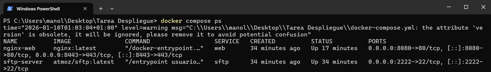

8) Persistencia (Volumen compartido)

He comprobado que los archivos subidos por SFTP son accesibles desde el contenedor de Nginx gracias al volumen compartido.

- Que demuestra: El volumen compartido funciona correctamente entre ambos contenedores
- Evidencia:
  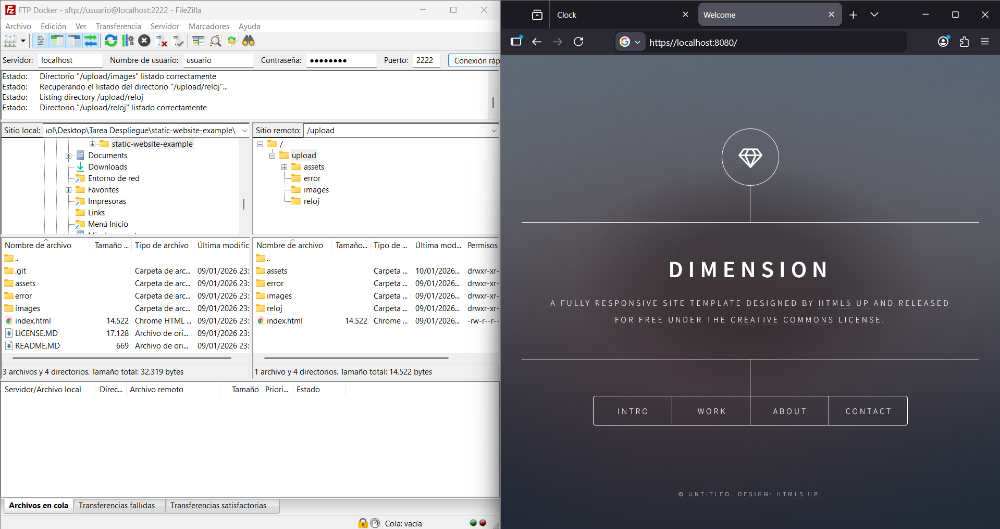

9) Despliegue multi-sitio

He configurado Nginx para servir el sitio principal en la raíz y otro sitio en la ruta /reloj, y he verificado que ambos funcionan.

- Que demuestra: El servidor Nginx sirve múltiples sitios (root y /reloj)
- Evidencia:
  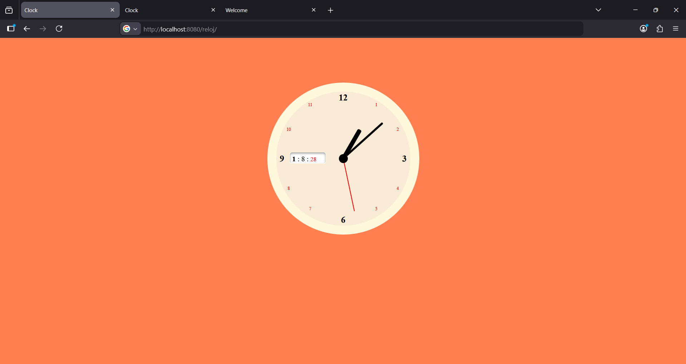

### Fase 4: Seguridad HTTPS

10) Cifrado SSL

He generado un certificado autofirmado y lo he configurado en Nginx para habilitar HTTPS en el puerto 8443.

- Que demuestra: El sitio funciona correctamente con HTTPS usando certificado autofirmado
- Evidencia:
  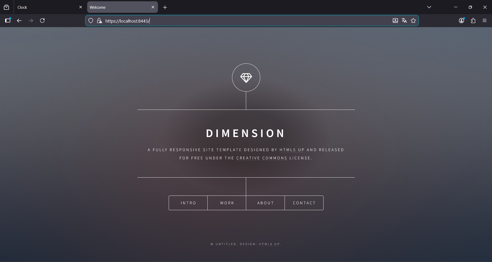

11) Redireccion forzada

He configurado Nginx para redirigir automáticamente todas las peticiones HTTP a HTTPS y he verificado que devuelve un código 301.

- Que demuestra: Las peticiones HTTP son redirigidas automáticamente a HTTPS (código 301)
- Evidencia:
  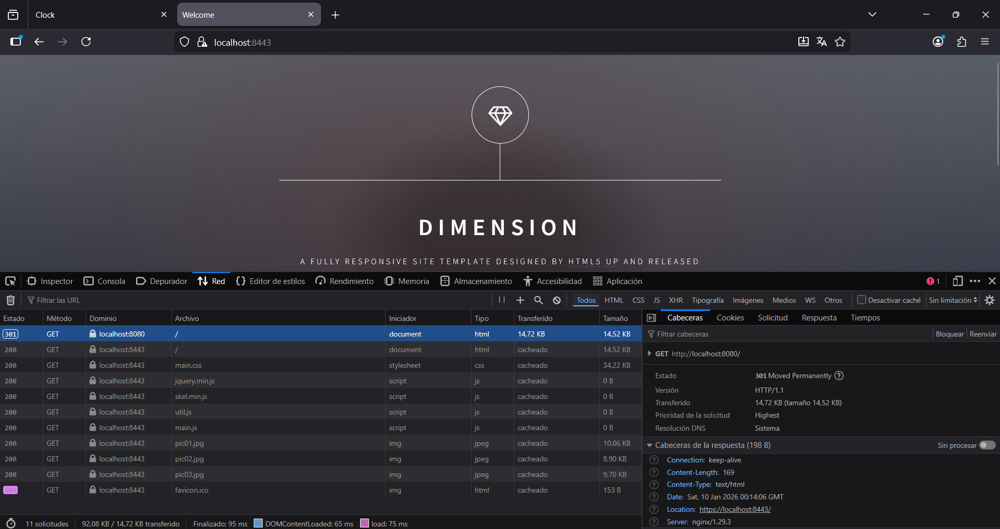

---

## Parte 2 — Evaluacion RA2 (a–j)

### a) Parametros de administracion
- Respuesta:
Se han localizado y analizado las directivas principales de `/etc/nginx/nginx.conf` del contenedor. Se modificó `keepalive_timeout` de 65 a 30 segundos en `default.conf` (volumen montado) sin editar directamente el nginx.conf del contenedor. El cambio fue validado con `nginx -t` y aplicado con `nginx -s reload` sin interrumpir el servicio.
- Evidencias:
  - evidencias/a-01-grep-nginxconf.png
    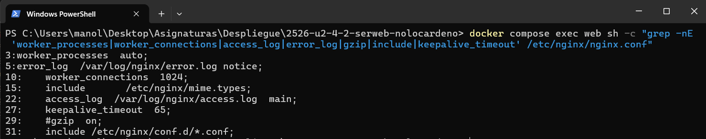
  - evidencias/a-02-nginx-t.png
    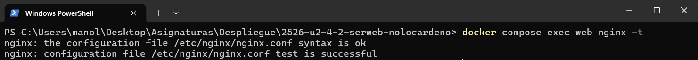
  - evidencias/a-03-reload.png
    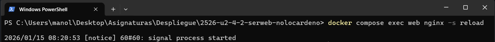
  - evidencias/a-04-done.png
    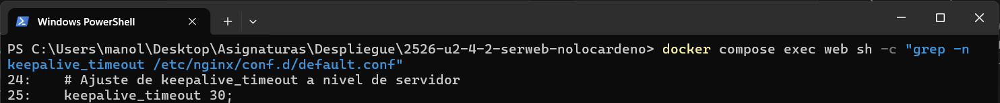

### b) Ampliacion de funcionalidad + modulo investigado
- Opcion elegida (B2): Cabeceras de seguridad
- Respuesta:
Se han añadido cabeceras de seguridad HTTP en el bloque server de HTTPS del archivo default.conf para mejorar la protección contra ataques comunes. Las cabeceras implementadas son X-Content-Type-Options (previene MIME sniffing), X-Frame-Options (protege contra clickjacking) y Content-Security-Policy (define política de contenidos permitidos).
- Evidencias (B2):
  - evidencias/b2-01-defaultconf-headers.png
  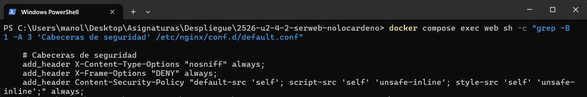
    
    Significado de cada cabecera:
    - X-Content-Type-Options: nosniff - Impide que el navegador intente adivinar el tipo MIME de los archivos, obligándolo a respetar el Content-Type declarado. Previene ataques de MIME sniffing.
    - X-Frame-Options: DENY - Bloquea que la página sea mostrada dentro de un iframe, frame o object. Protege contra ataques de clickjacking.
    - Content-Security-Policy - Define qué recursos puede cargar la página. La política implementada permite solo recursos del mismo origen ('self'), con excepción de scripts y estilos inline necesarios para el funcionamiento de la web.
    
  - evidencias/b2-02-nginx-t.png
    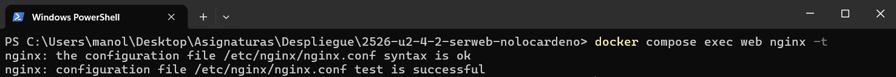
    
  - evidencias/b2-03-curl-https-headers.png
    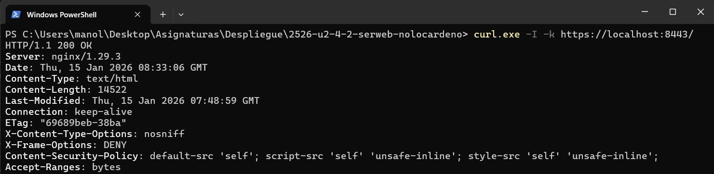

#### Modulo investigado: ngx_http_headers_module
- Para que sirve:
Permite establecer cabeceras HTTP personalizadas en las respuestas del servidor. Se utiliza mediante la directiva `add_header` para añadir o modificar cabeceras de respuesta, siendo esencial para implementar políticas de seguridad (como X-Frame-Options, Content-Security-Policy, HSTS), control de caché, CORS, y otras funcionalidades que requieren cabeceras HTTP específicas.
- Como se instala/carga:
Es un módulo incluido por defecto en la compilación estándar de nginx (módulo built-in), por lo que no requiere instalación adicional ni configuración de `load_module`. Está disponible automáticamente al instalar nginx desde repositorios oficiales o al compilar desde código fuente sin flags de exclusión específicos.
- Fuente(s):
  - Documentación oficial: https://nginx.org/en/docs/http/ngx_http_headers_module.html

### c) Sitios virtuales / multi-sitio
- Respuesta:
  **Diferencia entre multi-sitio por path y por nombre:**
  - El multi-sitio por path sirve múltiples contenidos desde el mismo dominio usando rutas diferentes (ej: `example.com/` y `example.com/reloj`), implementado mediante bloques `location` dentro del mismo `server`.
  - El multi-sitio por nombre (server_name) utiliza diferentes dominios o subdominios (ej: `sitio1.com` y `sitio2.com`) en bloques `server` separados que responden según el encabezado HTTP Host.
  
  **Tipos adicionales de multi-sitio:**
  - Por puerto: Diferentes servicios en el mismo servidor escuchando en puertos distintos (ej: puerto 80 para web pública, 8080 para admin). Cada bloque `server` tiene un `listen` con puerto diferente.
  - Por dirección IP: Cuando el servidor tiene múltiples IPs asignadas, cada `server` block puede escuchar en una IP específica mediante `listen IP:puerto`, permitiendo servir contenido diferente según la IP de destino.
  - Por subdominios: Variante del multi-sitio por nombre donde se usan subdominios del mismo dominio principal (ej: `blog.example.com`, `tienda.example.com`, `api.example.com`), cada uno con su propio bloque `server` y `server_name` específico.   

  **Directivas clave:**
  - root: Define el directorio raíz desde donde nginx sirve los archivos (`/usr/share/nginx/html`)
  - location: Bloque que define cómo procesar peticiones a URLs específicas (`/` para raíz, `/reloj` para el reloj)
  - try_files: Intenta servir archivos en orden: primero el archivo exacto (uri), luego como directorio (uri/), sino devuelve 404
  - alias: Usado en `/reloj` para mapear la URL a una ubicación diferente del filesystem, permitiendo servir contenido de `/usr/share/nginx/html/reloj` cuando se accede a `/reloj`

- Evidencias:
  - evidencias/c-01-root.png
    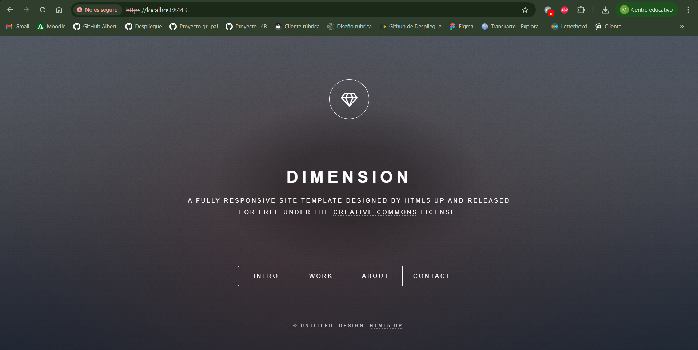
  - evidencias/c-02-reloj.png
    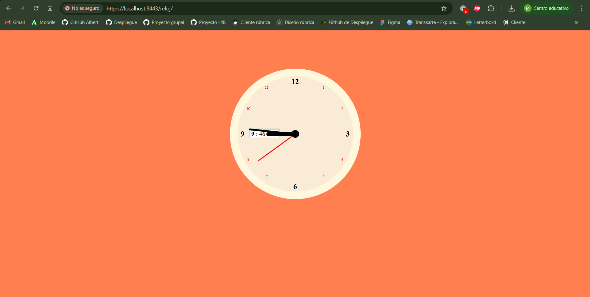
  - evidencias/c-03-defaultconf-inside.png
    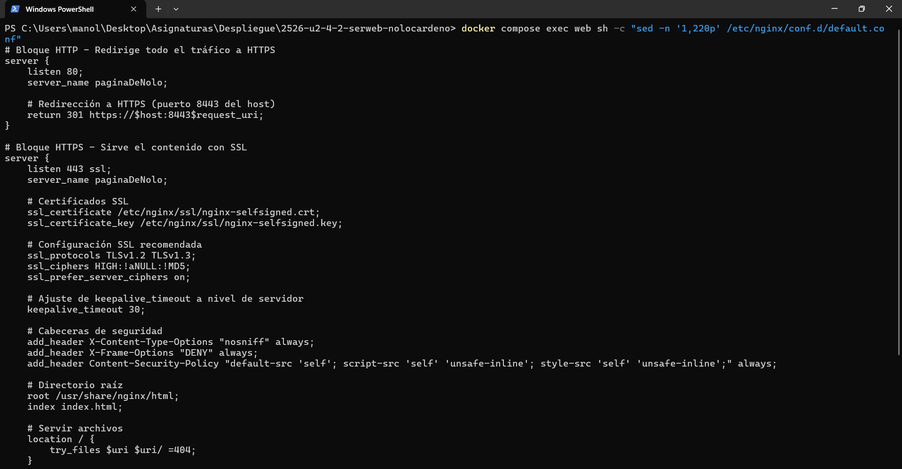

### d) Autenticacion y control de acceso
- Respuesta:
  Se ha implementado autenticación HTTP básica (auth_basic) para proteger la ruta `/admin/`. Se creó un directorio admin con un archivo index.html y un archivo `.htpasswd` con credenciales cifradas (usuario: admin, contraseña: admin123). La configuración utiliza las directivas `auth_basic` para mostrar el mensaje de autenticación y `auth_basic_user_file` para especificar el archivo de credenciales.

  **Pruebas realizadas:**
  - Sin credenciales: retorna **401 Unauthorized** con cabecera `WWW-Authenticate: Basic realm="Area Restringida - Admin"`
  - Con credenciales correctas (admin:admin123): retorna **200 OK** y muestra el contenido

- Evidencias:
  - evidencias/d-01-admin-html.png
    
  - evidencias/d-02-defaultconf-auth.png
    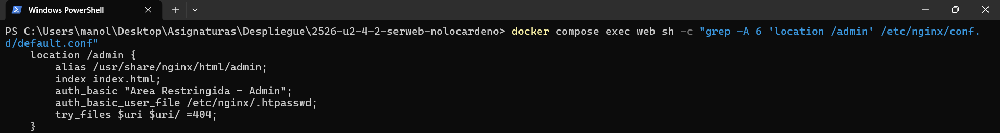
  - evidencias/d-03-curl-401.png
    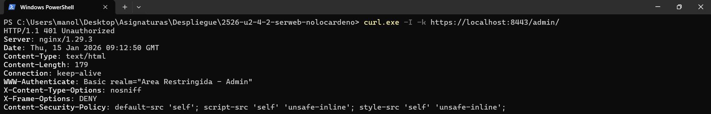
  - evidencias/d-04-curl-200.png
    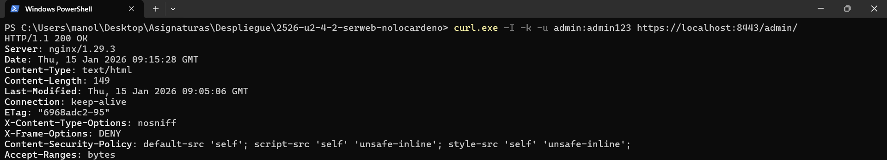

### e) Certificados digitales
- Respuesta:
  Se ha generado un certificado SSL autofirmado para habilitar HTTPS en el servidor Nginx. El proceso utilizó OpenSSL para crear dos archivos esenciales:
  
  **¿Qué es .crt y .key?**
  - **.crt (Certificate)**: Es el certificado digital que contiene la clave pública y la información de identidad del servidor. Este archivo se envía al navegador del cliente durante para establecer la conexión cifrada. Contiene datos como el nombre del servidor, la clave pública, el emisor y las fechas de validez.
  - **.key (Private Key)**: Es la clave privada del servidor que debe mantenerse completamente secreta y protegida. Se utiliza para descifrar la información que los clientes cifran con la clave pública del certificado .crt.
  
  **¿Por qué se usa -nodes en laboratorio?**
  La opción `-nodes` en el comando OpenSSL indica que la clave privada no debe cifrarse con una contraseña. Esto significa:
  - En **producción**: NO se recomienda usar -nodes, ya que la clave privada debería estar protegida con contraseña. Si alguien accede al archivo .key sin cifrar, puede comprometer completamente la seguridad del servidor.
  - En **laboratorio/desarrollo**: Se usa -nodes por conveniencia, porque evita tener que introducir la contraseña cada vez que se inicia o recarga Nginx. Esto facilita el desarrollo, las pruebas y el reinicio automático de servicios en contenedores Docker.
  
- Evidencias:
  - evidencias/e-01-ls-certs.png
    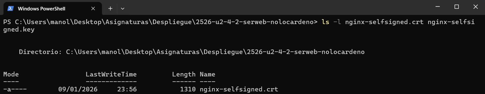
  - evidencias/e-02-compose-certs.png
    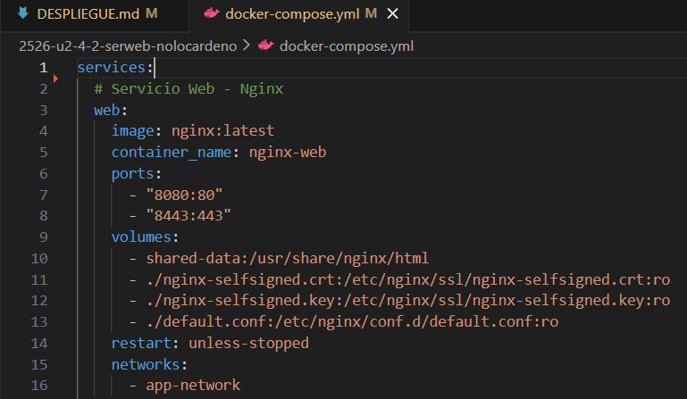
  - evidencias/e-03-defaultconf-ssl.png
    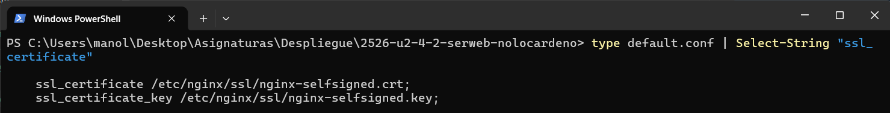

### f) Comunicaciones seguras
- Respuesta:
  Se ha implementado HTTPS con certificado SSL y redirección automática de HTTP a HTTPS. La configuración utiliza dos bloques `server` diferentes en Nginx:
  
  Se accede al sitio web mediante `https://localhost:8443` y el navegador establece una conexión cifrada usando el certificado autofirmado. Aunque el navegador muestra advertencia de seguridad (esperado en certificados autofirmados), la conexión HTTPS funciona correctamente, cifrando todo el tráfico entre cliente y servidor.
  
  Al acceder mediante HTTP (`http://localhost:8080`), el servidor responde con código de estado 301 Moved Permanently y cabecera `Location` que redirige al cliente automáticamente a la versión HTTPS del sitio. Esta redirección permanente indica a navegadores y motores de búsqueda que la versión HTTPS es la ubicación definitiva del recurso.
  
  Se utilizan dos bloques `server` separados (puerto 80 y puerto 443) por las siguientes razones:
  - **Separación de responsabilidades**: El bloque del puerto 80 (HTTP) tiene una única función: redirigir tráfico al puerto 443 (HTTPS).
  - **Bloque HTTPS completo**: El bloque del puerto 443 (HTTPS) contiene toda la configuración real del sitio: certificados SSL, directivas de seguridad, locations, cabeceras, autenticación, etc.
  - **Claridad y mantenimiento**: Tener bloques separados hace la configuración más legible y fácil de mantener. Se puede modificar la lógica de redirección sin tocar la configuración del servicio HTTPS.

- Evidencias:
  - evidencias/f-01-https.png
    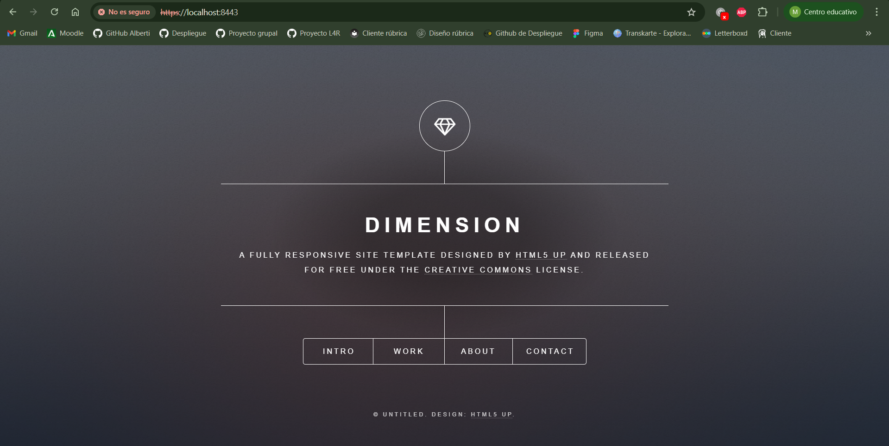
  - evidencias/f-02-301-network.png
    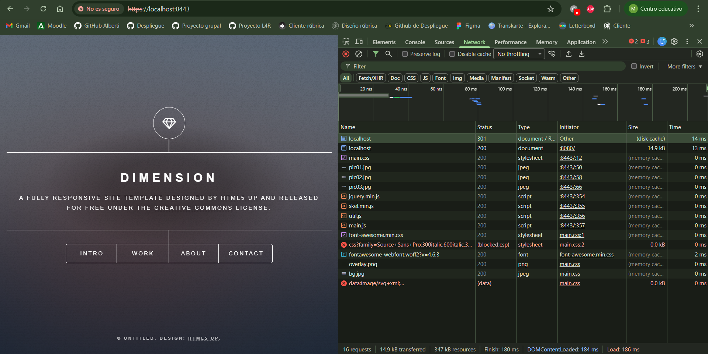

### g) Documentacion
- Respuesta:
  Esta práctica implementa un servidor web Nginx con SFTP para transferencia de archivos, todo desplegado mediante contenedores Docker. A continuación se documenta la arquitectura, configuración y seguridad implementadas:
  
  **Arquitectura (servicios, puertos, volúmenes):**
  - **Servicios**: Dos contenedores Docker conectados mediante con docker-compose:
    - `web`: Nginx (imagen oficial nginx:alpine) - Servidor web HTTP/HTTPS
    - `sftp`: atmoz/sftp - Servidor SFTP para transferencia de archivos
  - **Puertos**:
    - 8080:80 - HTTP (redirige a HTTPS)
    - 8443:443 - HTTPS (puerto principal del sitio)
    - 2222:22 - SFTP (puerto para FileZilla)
  - **Volúmenes compartidos**:
    - `./static-website-example-master:/usr/share/nginx/html:ro` - Sitio principal (solo lectura)
    - `./static-clock-website-main:/usr/share/nginx/html/reloj:ro` - Sitio /reloj (solo lectura)
    - `./default.conf:/etc/nginx/conf.d/default.conf:ro` - Configuración Nginx
    - `./server.crt:/etc/nginx/certs/server.crt:ro` - Certificado SSL
    - `./server.key:/etc/nginx/certs/server.key:ro` - Clave privada SSL
    - `./.htpasswd:/etc/nginx/.htpasswd:ro` - Credenciales de autenticación
    - Volumen compartido entre web y sftp para permitir gestión de archivos
  
  **Configuración Nginx (ubicación de default.conf, server blocks, root, /reloj):**
  - **Ubicación**: El archivo `default.conf` se encuentra en la raíz del proyecto y se monta en `/etc/nginx/conf.d/default.conf` dentro del contenedor
  - **Server blocks**: Se utilizan dos bloques server:
    - Bloque HTTP (puerto 80): Redirige todo el tráfico a HTTPS con código 301
    - Bloque HTTPS (puerto 443): Contiene toda la configuración del sitio web
  - **Root**: La directiva `root /usr/share/nginx/html;` define el directorio raíz para servir archivos del sitio principal
  - **Location /reloj**: Se utiliza `alias /usr/share/nginx/html/reloj;` para mapear la ruta `/reloj` al directorio del sitio del reloj, permitiendo multi-sitio por path
  - **Location /admin**: Protegido con autenticación HTTP básica usando directivas `auth_basic` y `auth_basic_user_file`
  
  **Seguridad (certificados, HTTPS, redirect, opción B elegida):**
  - **Certificados SSL**: Generados con OpenSSL usando el comando `openssl req -x509 -nodes -days 365 -newkey rsa:2048`. Archivos `server.crt` (certificado) y `server.key` (clave privada) montados en `/etc/nginx/certs/`
  - **HTTPS**: Configurado en puerto 443 con directivas `ssl_certificate` y `ssl_certificate_key` apuntando a los certificados montados
  - **Redirect HTTP→HTTPS**: Implementado con `return 301 https://$host:8443$request_uri;` en el bloque server del puerto 80, forzando conexiones seguras
  - **Opción B2 - Cabeceras de seguridad**: Se implementaron tres cabeceras HTTP de seguridad:
    - `X-Content-Type-Options: nosniff` - Previene MIME sniffing
    - `X-Frame-Options: DENY` - Protege contra clickjacking
    - `Content-Security-Policy` - Define política de recursos permitidos
  
  **Autenticación /admin:**
  - Ruta `/admin/` protegida con HTTP Basic Authentication
  - Credenciales almacenadas en archivo `.htpasswd` (usuario: admin, contraseña: admin123)
  - Configuración mediante directivas `auth_basic "Area Restringida - Admin"` y `auth_basic_user_file /etc/nginx/.htpasswd`
  - Acceso sin credenciales retorna código 401 Unauthorized
  
  **Logs y análisis (criterio j):**
  - Logs accesibles mediante `docker compose logs -f web` para monitorización en tiempo real
  - Registran peticiones HTTP/HTTPS, códigos de estado, redirecciones 301, y accesos autenticados
  - Útiles para debugging, análisis de tráfico y detección de problemas de configuración
  
  **Evidencias Parte 1 + Parte 2:**
  - Parte 1 - Evidencias mínimas:
    - [Requisito 1: Servicio activo](evidencias/requisito1.png)
    - [Requisito 2: Configuración cargada](evidencias/requisito2.png)
    - [Requisito 3: Resolución de nombres](evidencias/requisito3.png)
    - [Requisito 4: Contenido Web](evidencias/requisito4.png)
    - [Requisito 5: Conexión SFTP](evidencias/requisito5.png)
    - [Requisito 6: Permisos escritura](evidencias/requisito6.png)
    - [Requisito 7: Contenedores activos](evidencias/requisito7.png)
    - [Requisito 8: Persistencia](evidencias/requisito8.png)
    - [Requisito 9: Multi-sitio](evidencias/requisito9.png)
    - [Requisito 10: Cifrado SSL](evidencias/requisito10.png)
    - [Requisito 11: Redirección forzada](evidencias/requisito11.png)
  - Parte 2 - RA2 (a-j):
    - a) Parámetros de administración: [grep nginxconf](evidencias/a-01-grep-nginxconf.png) | [nginx -t](evidencias/a-02-nginx-t.png) | [reload](evidencias/a-03-reload.png) | [done](evidencias/a-04-done.png)
    - b) Ampliación de funcionalidad + módulo investigado: [Config](evidencias/b2-01-defaultconf-headers.png) | [Test](evidencias/b2-02-nginx-t.png) | [Curl](evidencias/b2-03-curl-https-headers.png)
    - c) Sitios virtuales / multi-sitio: [Root](evidencias/c-01-root.png) | [Reloj](evidencias/c-02-reloj.png) | [Config](evidencias/c-03-defaultconf-inside.png)
    - d) Autenticación y control de acceso: [HTML](evidencias/d-01-admin-html.png) | [Config](evidencias/d-02-defaultconf-auth.png) | [401](evidencias/d-03-curl-401.png) | [200](evidencias/d-04-curl-200.png)
    - e) Certificados digitales: [ls](evidencias/e-01-ls-certs.png) | [Compose](evidencias/e-02-compose-certs.png) | [SSL](evidencias/e-03-defaultconf-ssl.png)
    - f) Comunicaciones seguras: [Operativo](evidencias/f-01-https.png) | [301](evidencias/f-02-301-network.png)
    - h) Ajustes para implantación de apps: [Root](evidencias/h-01-root.png) | [Reloj](evidencias/h-02-reloj.png)
    - i) Virtualización en despliegue: [compose ps](evidencias/i-01-compose-ps.png)
    - j) Logs: monitorización y análisis: [Follow](evidencias/j-01-logs-follow.png) | [Métricas](evidencias/j-02-metricas.png)

- Evidencias: Todas las capturas están enlazadas arriba organizadas por criterio

### h) Ajustes para implantacion de apps
- Respuesta:
  **Despliegue de una segunda app en /reloj (rutas relativas/absolutas):**
  Al desplegar la aplicación del reloj en la ruta `/reloj`, se deben considerar las referencias a recursos estáticos (CSS, JS, imágenes) dentro del HTML:
  
  - **Rutas absolutas** (ej: `/style.css`, `/script.js`): Buscan los archivos desde la raíz del sitio web (`/`). Si el HTML del reloj usa rutas absolutas, al acceder a `https://localhost:8443/reloj`, el navegador buscará `/style.css` en la raíz principal en vez de `/reloj/style.css`, causando errores 404. **Problema**: Los recursos no se encuentran porque apuntan a la raíz `/` y no a `/reloj/`.
  
  - **Rutas relativas** (ej: `style.css`, `./script.js`): Buscan los archivos relativos a la ubicación del HTML actual. Al acceder a `/reloj/index.html` con rutas relativas, el navegador buscará `style.css` en `/reloj/style.css`, que es la ubicación correcta. **Solución**: Los archivos HTML de aplicaciones servidas en subdirectorios deben usar rutas relativas para que los recursos se resuelvan correctamente.
  
  En esta práctica, el sitio del reloj (`static-clock-website-main`) utiliza rutas relativas (`<link rel="stylesheet" href="style.css">` y `<script src="script.js">`), por lo que funciona correctamente al ser montado en `/reloj` mediante la directiva `alias /usr/share/nginx/html/reloj;`.
  
  **Problema típico de permisos al subir por SFTP y solución:**
  - **Problema**: Al subir archivos mediante SFTP con FileZilla, los archivos pueden crearse con permisos restrictivos (ej: 600 o 640) o con un propietario diferente al usuario que ejecuta Nginx dentro del contenedor. Esto causa errores 403 Forbidden cuando Nginx intenta leer los archivos, ya que el proceso worker de Nginx (típicamente usuario `nginx` o `www-data`) no tiene permisos de lectura.
  
  - **Síntomas**: Después de subir archivos por SFTP, al acceder desde el navegador se obtiene error 403 Forbidden, y los logs de Nginx muestran mensajes como "Permission denied" o "failed (13: Permission denied)".
  
  - **Solución implementada**: 
    1. Configurar el servidor SFTP para que los archivos subidos tengan permisos 644 (lectura para todos, escritura solo para propietario) mediante la configuración del umask del usuario SFTP.
    2. Los volúmenes en docker-compose se montan con la opción `:ro` (read-only) para archivos estáticos, lo que significa que el contenido se gestiona desde el host y no se modifica desde dentro del contenedor.
    3. Asegurar que el usuario del contenedor SFTP y el usuario de Nginx compartan el volumen con permisos adecuados. En este caso, el volumen compartido entre `web` y `sftp` permite que ambos accedan a los archivos sin conflictos de permisos.
    4. Alternativamente, ejecutar dentro del contenedor: `chmod -R 755 /usr/share/nginx/html` para dar permisos de lectura y ejecución a todos los archivos y directorios.

- Evidencias:
  - evidencias/h-01-root.png
    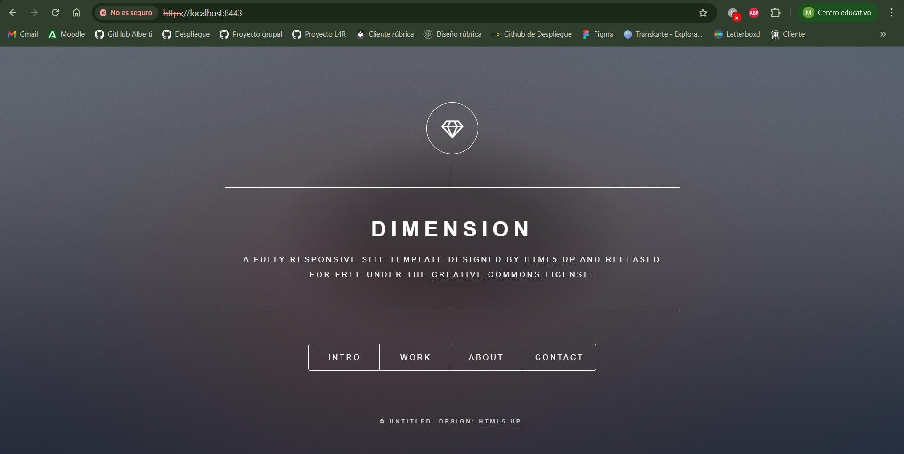
  - evidencias/h-02-reloj.png
    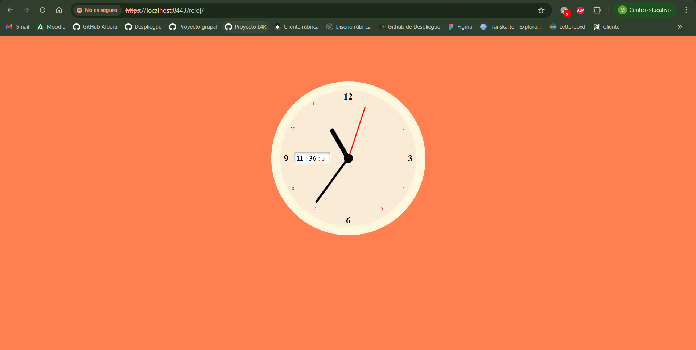

### i) Virtualizacion en despliegue
- Respuesta:
  Se ha utilizado Docker y Docker Compose para desplegar la infraestructura. Diferencias operativas entre enfoques:
  
  **Instalación nativa en Sistema Operativo:**
  - Nginx instalado permanentemente en el SO mediante gestores de paquetes (apt, yum, chocolatey)
  - Configuración en rutas fijas del sistema (`/etc/nginx/`, `C:\nginx\conf\`)
  - Dependiente de la versión disponible en repositorios del SO
  - Sin aislamiento: comparte recursos, puertos y librerías con el SO
  - Baja portabilidad: migrar requiere reinstalar y adaptar configuración al nuevo SO
  - Gestión manual mediante comandos nativos y servicios del sistema
  
  **Contenedor efímero + configuración por volúmenes:**
  - Contenedor temporal y desechable: se crea/destruye en segundos sin afectar el SO host
  - Configuración persistente externa: `default.conf` y certificados en el host se montan como volúmenes
  - Independiente del SO: misma imagen funciona en Windows, Linux, macOS sin cambios
  - Aislamiento completo: sistema de archivos, red y procesos propios
  - Portabilidad total: copiar `docker-compose.yml` + volúmenes y ejecutar en cualquier máquina
  
  **Ventajas en esta práctica:**
  - Despliegue reproducible en cualquier entorno
  - Servicios aislados (web y sftp) pero comunicados
  - Rollback rápido: `docker compose down` vuelve al estado anterior
  - Actualizaciones sin riesgo: cambiar versión en docker-compose.yml y recrear

- Evidencias:
  - evidencias/i-01-compose-ps.png
    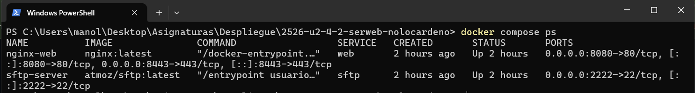

### j) Logs: monitorizacion y analisis
- Respuesta:
  En contenedores Docker con Nginx, los logs se redirigen a stdout/stderr en lugar de archivos tradicionales. El análisis de logs es fundamental para monitorizar el tráfico, detectar errores y optimizar el servidor.
  
  **Arquitectura de logs en Docker:**
  - Los archivos `/var/log/nginx/access.log` y `/var/log/nginx/error.log` dentro del contenedor son **enlaces simbólicos** a `/dev/stdout` y `/dev/stderr` respectivamente
  - Docker captura automáticamente todo lo que se escribe en stdout/stderr y lo almacena en su sistema de logs
  - Esto permite acceder a los logs sin necesidad de entrar al contenedor o montar volúmenes adicionales
  
  **Comandos de monitorización:**
  
  1. **Ver logs en tiempo real** (modo follow):
     ```powershell
     docker compose logs -f web
     ```
     Muestra todas las peticiones HTTP/HTTPS en tiempo real, útil para debugging y ver la actividad del servidor.
  
  2. **Ver últimas N líneas**:
     ```powershell
     docker compose logs --tail=50 web
     ```
     Muestra solo las últimas 50 líneas, útil para revisión rápida sin saturar la terminal.
  
  3. **Filtrar logs por patrón**:
     ```powershell
     docker compose logs web | Select-String "404"
     docker compose logs web | Select-String "301"
     docker compose logs web | Select-String "/admin"
     ```
     Busca líneas específicas: errores 404, redirecciones 301, accesos al área restringida, etc.
  
  **Análisis de métricas:**
  
  Para analizar los logs, primero se exportan a un archivo:
  ```powershell
  docker compose logs web --no-log-prefix > access.log
  ```
  
  1. **URLs más solicitadas**:
     ```powershell
     Get-Content access.log | ForEach-Object { if($_ -match '"(GET|POST|PUT|DELETE) ([^ ]+)') { $matches[2] } } | Group-Object | Sort-Object Count -Descending | Select-Object -First 10 Count, Name
     ```
     Identifica qué recursos son más accedidos, útil para optimizar caché.
  
  2. **Códigos de estado HTTP más frecuentes**:
     ```powershell
     Get-Content access.log | ForEach-Object { if($_ -match '" (\d{3}) ') { $matches[1] } } | Group-Object | Sort-Object Count -Descending | Select-Object Count, Name
     ```
     Muestra distribución de códigos: 200 (OK), 301 (Redirect), 404 (Not Found), etc.
  
  3. **URLs que generaron error 404**:
     ```powershell
     Get-Content access.log | ForEach-Object { if($_ -match '" 404 ' -and $_ -match '"(GET|POST) ([^ ]+)') { $matches[2] } } | Group-Object | Sort-Object Count -Descending | Select-Object Count, Name
     ```
     Detecta enlaces rotos, recursos inexistentes o intentos de acceso a rutas no válidas.
  
  **Generación de tráfico para pruebas:**
  ```powershell
  # 20 peticiones HTTP (generan redirección 301 a HTTPS)
  1..20 | ForEach-Object { curl.exe -s -o nul http://localhost:8080/ }
  
  # 10 peticiones que generan 404
  1..10 | ForEach-Object { curl.exe -s -o nul http://localhost:8080/no-existe-$_ }
  ```
  
  **Información visible en los logs:**
  - IP del cliente
  - Fecha y hora de la petición
  - Método HTTP (GET, POST, etc.)
  - URL solicitada
  - Código de estado de respuesta (200, 301, 404, 401, etc.)
  - Tamaño de la respuesta en bytes
  - User-Agent del navegador/cliente
  - Referer (página de origen de la petición)
  
  **Utilidad práctica:**
  - Verificar que las redirecciones HTTP→HTTPS funcionan (código 301)
  - Detectar intentos de acceso no autorizados a /admin (código 401)
  - Identificar recursos no encontrados para corregir enlaces rotos
  - Analizar patrones de tráfico y uso del sitio
  - Debugging de problemas de configuración en tiempo real

- Evidencias:
  - evidencias/j-01-logs-follow.png
    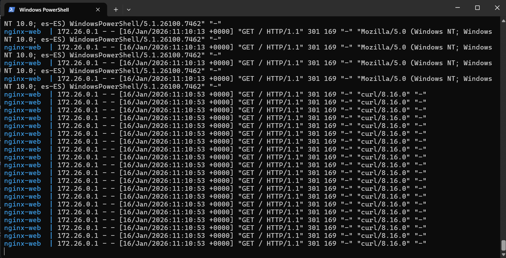
  - evidencias/j-02-metricas.png
    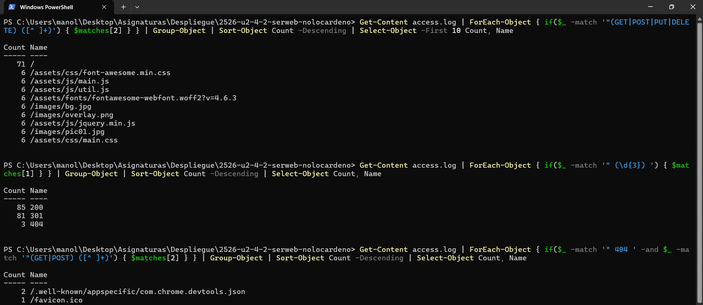

---

## Checklist final

### Parte 1
- [x] 1) Servicio Nginx activo
- [x] 2) Configuracion cargada
- [x] 3) Resolucion de nombres
- [x] 4) Contenido Web (Cloud Academy)
- [x] 5) Conexion SFTP exitosa
- [x] 6) Permisos de escritura
- [x] 7) Contenedores activos
- [x] 8) Persistencia (Volumen compartido)
- [x] 9) Despliegue multi-sitio (/reloj)
- [x] 10) Cifrado SSL
- [x] 11) Redireccion forzada (301)

### Parte 2 (RA2)
- [x] a) Parametros de administracion
- [x] b) Ampliacion de funcionalidad + modulo investigado
- [x] c) Sitios virtuales / multi-sitio
- [x] d) Autenticacion y control de acceso
- [x] e) Certificados digitales
- [x] f) Comunicaciones seguras
- [x] g) Documentacion
- [x] h) Ajustes para implantacion de apps
- [x] i) Virtualizacion en despliegue
- [x] j) Logs: monitorizacion y analisis
